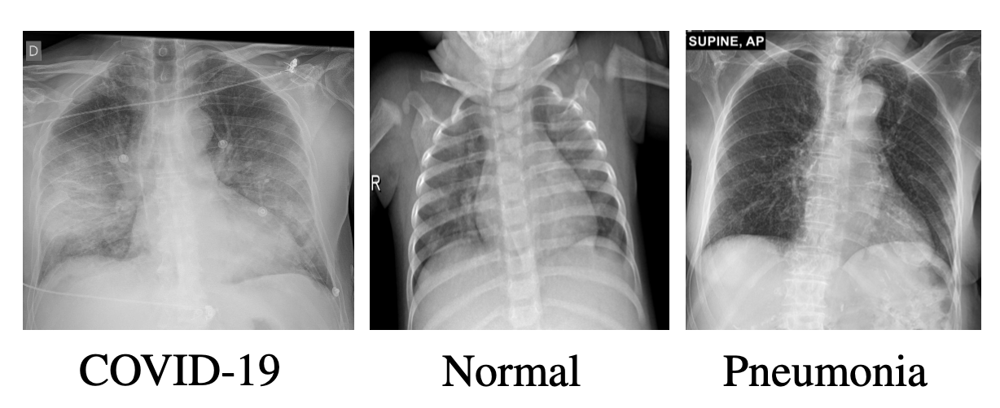
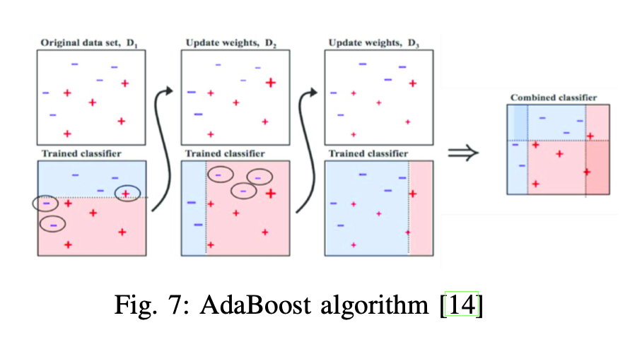
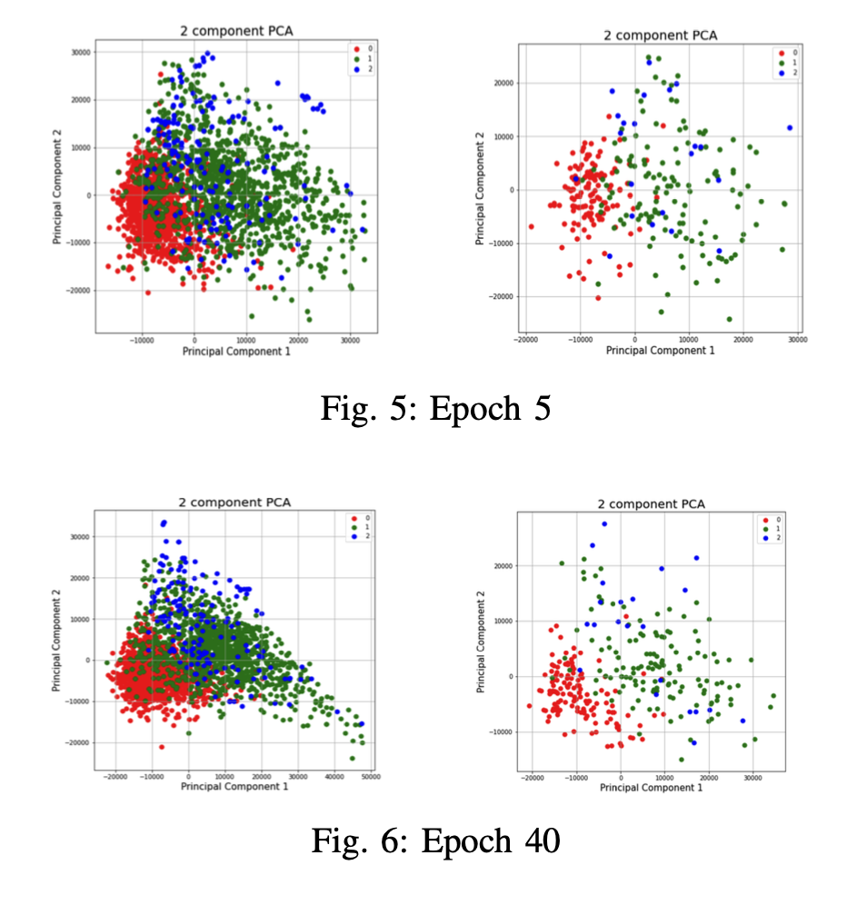
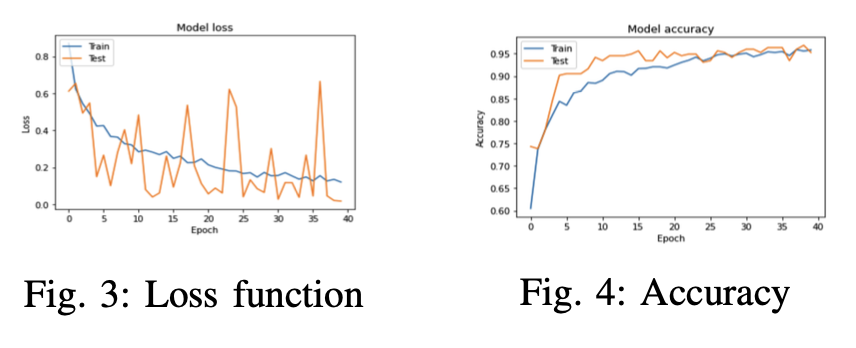

# COVID-19 Detection Using X-ray Images

## Project Overview

This project is an exploration into the capabilities of utilizing X-ray images for the detection of COVID-19 cases. Leveraging a robust dataset and advanced machine learning techniques, the endeavor aims to lay the groundwork for improved diagnostic procedures and enhance our understanding of how imaging can contribute to tackling the pandemic.

## Dataset

The dataset is comprised of the following X-ray images:

- 219 images of COVID-19 cases
- 1345 images of Viral Pneumonia cases
- 1341 images of normal chest X-rays

### Dataset Distribution

| Class Label | Raw Train | Raw Valid. | Raw Test | Augmented Train | Augmented Valid. | Augmented Test |
|-------------|-----------|------------|----------|------------------|------------------|-----------------|
| COVID-19    | 141       | 35         | 43       | 2820             | 700              | 43              |
| Normal      | 858       | 215        | 268      | 2574             | 645              | 268             |
| Pneumonia   | 861       | 215        | 269      | 2583             | 645              | 269             |

*Table I: COVID-19 dataset with class distributions.*

## Methodology

### AdaBoost

AdaBoost emerged as the most successful model in terms of accuracy, demonstrating the potential for ensemble learning in medical image analysis.

#### AdaBoost Results

| Class Label | Precision | Recall | F-1  | Accuracy |
|-------------|-----------|--------|------|----------|
| COVID-19    | 1         | 0.95   | 0.98 | 0.97     |
| Normal      | 0.97      | 0.97   | 0.97 | -        |
| Pneumonia   | 0.97      | 0.97   | 0.97 | -        |

*Table IX: Results of AdaBoost algorithm.*

### Transfer Learning

The project also explores the effectiveness of transfer learning by combining CNN and several classifiers. combining Convolutional Neural Networks (CNN) with XGBoost, showing promise in extracting features and handling classification tasks.

| Method       | Accuracy |
|--------------|----------|
| PCA(59)+KNN  | 0.86     |
| PCA(59)+XGB | 0.84     |
| XGB          | 0.88     |

*Table II: Results of transfer learning.*

## Augmented Data and Self-Supervised Learning

The project also delves into testing the models with augmented data and discusses the prospects of self-supervised learning. The exploration points towards the possibility that, given a larger dataset, self-supervised learning could play a pivotal role in enhancing the model's performance.
